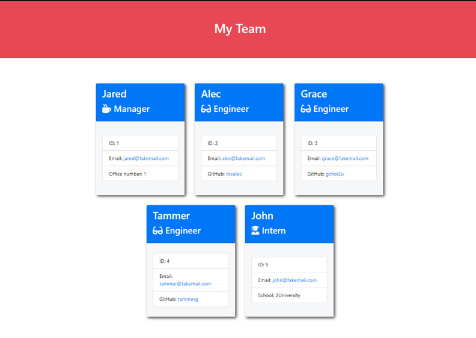

# Team-Profile-Generator
    
## Description
Node.js command-line application that takes in information about employees on a software engineering team, then generates an HTML webpage that displays summaries for each person
    
---
  
    
### Usage
AS A manager
I WANT to generate a webpage that displays my team's basic info
SO THAT I have quick access to their emails and GitHub profiles
   
---
    
### License

   

    
---

    
### Contributors
    
Sudarshan Singh  
---
### Mock-up

    
   

  
    
### where to find it 
https://github.com/Sudarshans30/Team-profile-generater    

 
 ### Demo

    
